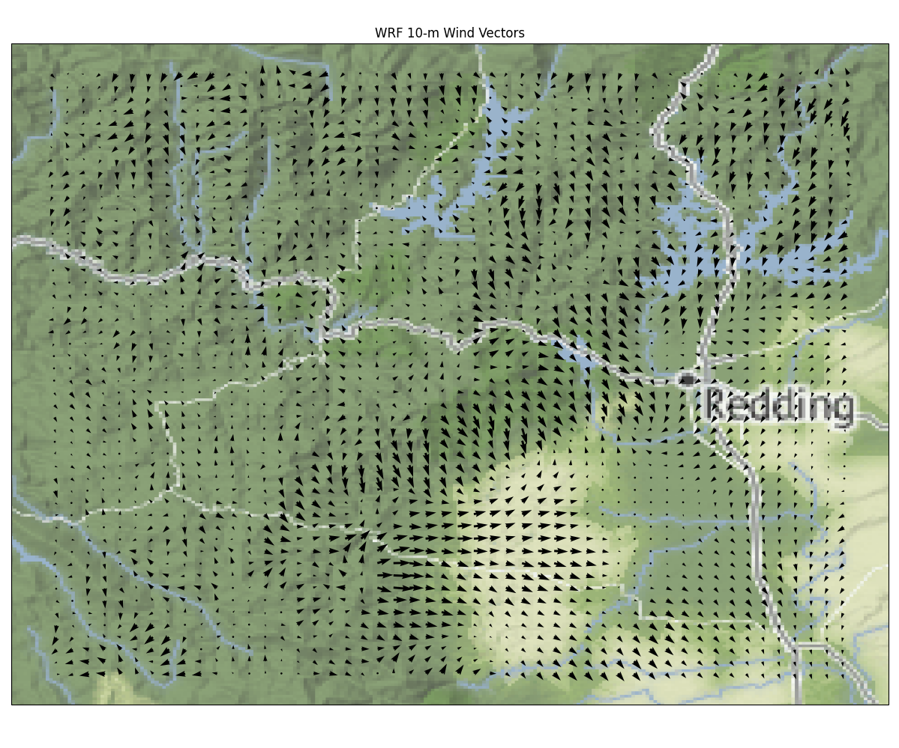
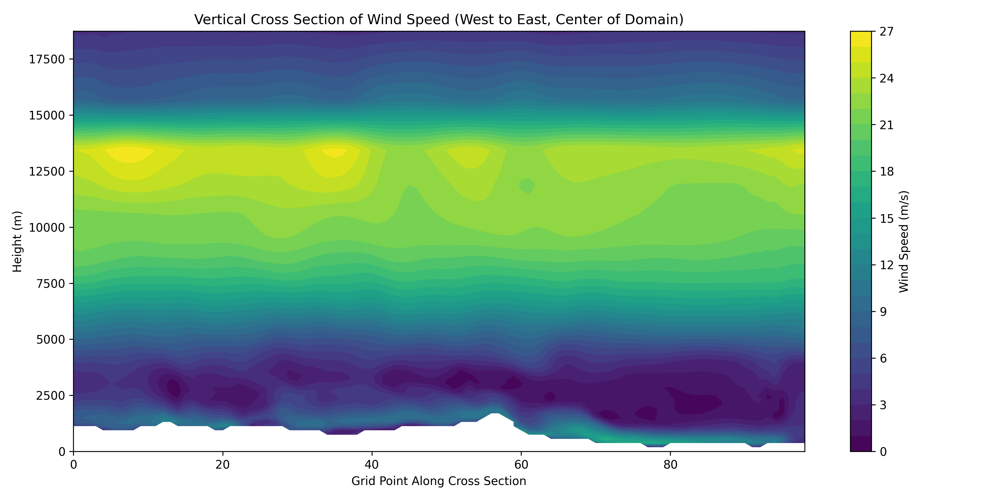
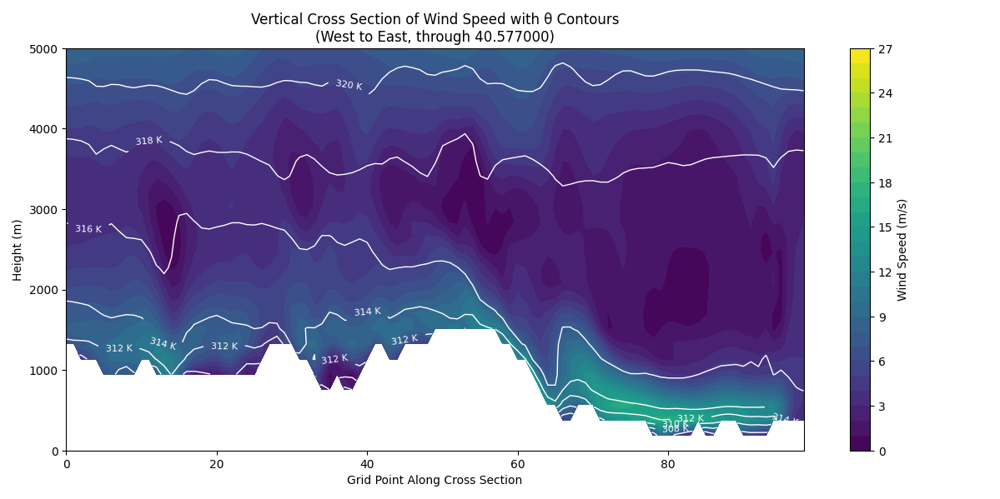
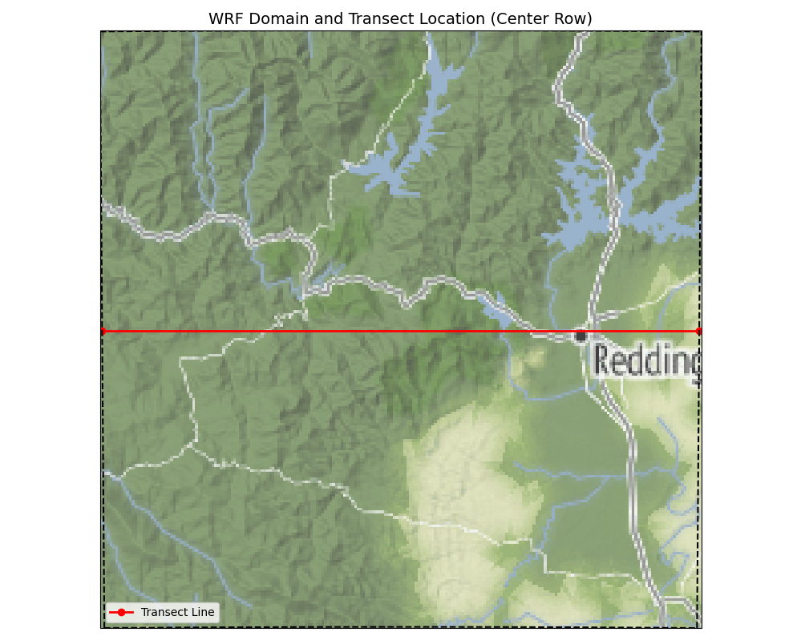

These scipts provide basic plotting capabilities
===
## Python
- plot_vectors.py

- plot_vertical_transect.py

- plot_vertical_transect_wind_theta.py

- plot_transect_location.py

## WindNinja 
- The tool `wrf_to_kmz` can generate a KMZ of the 10-m winds that can be loaded in Google Earth
